<div align="center">

# 🛰️ NetSentinel

### Advanced Network Observability & Intelligent Troubleshooting Platform

<br>

<p>
  <a href="https://net-sentinal-bncz.vercel.app/"></a>
  <a href="https://github.com/SiddharthaChathra/NetSentinal/releases/latest"></a>
</p>

<p>
  
  
  
  
  
</p>

<p>
  
  
  
  
  
  
</p>

<p>
  <a href="#-why-netsentinel"><b>Why</b></a> ·
  <a href="#-screenshots"><b>Screenshots</b></a> ·
  <a href="#-adding-a-machine"><b>Add a Machine</b></a> ·
  <a href="#%EF%B8%8F-architecture"><b>Architecture</b></a> ·
  <a href="#-technology-stack"><b>Stack</b></a> ·
  <a href="#-quick-start"><b>Quick Start</b></a> ·
  <a href="#-api-reference"><b>API</b></a> ·
  <a href="#%EF%B8%8F-security-model"><b>Security</b></a> ·
  <a href="#-license"><b>License</b></a>
</p>

</div>

<br>

<div align="center">
  <a href="https://net-sentinal-bncz.vercel.app/">
    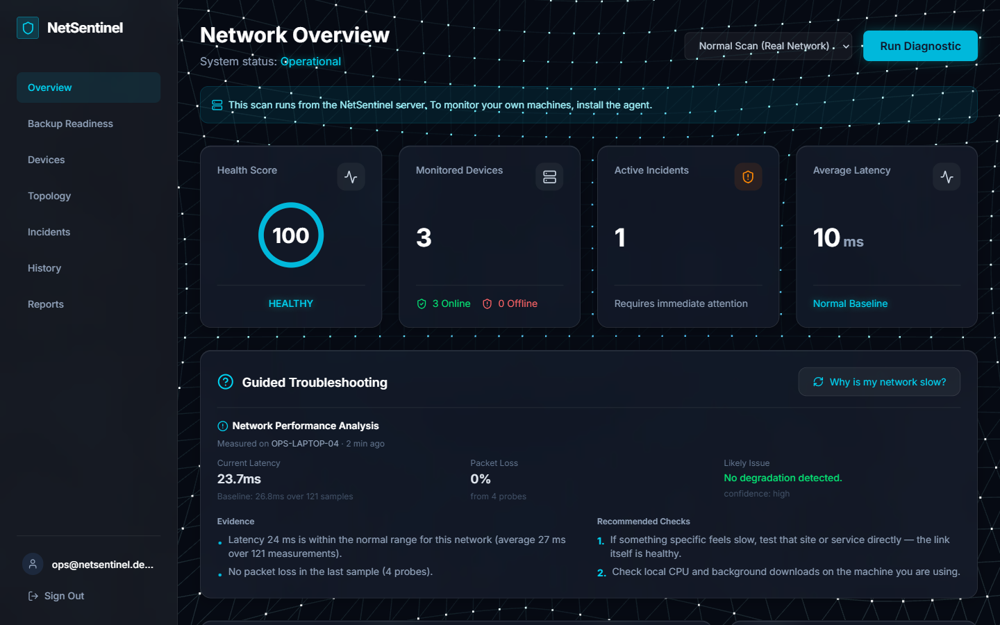
  </a>
</div>

<br>

NetSentinel monitors the network health of every machine on your account. A lightweight agent — a single downloadable executable, no Python required — reports latency, packet loss, DNS, gateway and backup-protocol state every minute. The backend builds statistical baselines from that history, detects anomalies against them, correlates evidence into incidents, scores backup readiness against an SLA window, and explains what it found in a dashboard and a printable engineer's report.

**Every figure it shows is measured.** Where there is not yet enough history to judge something, it says so rather than filling the gap with a plausible number.

> **The live app requires an account.** Sign-up is free and takes a few seconds — there is no anonymous mode, because every device, incident and report belongs to exactly one account.

<br>

## 🎯 Why NetSentinel?

<table>
<tr>
<td width="50%" valign="top">

**📡 Multi-Device Monitoring**
One account, any number of machines. Each registers under its own hostname and is scored separately.

**⬇️ One-File Agent**
Download, run, type an 8-character code. No Python, pip or git on the machine you are adding.

**🔍 Evidence-Based Diagnostics**
Rule-based correlation with stated confidence — every claim carries the measurement behind it.

**📊 Statistical Baselines**
Average, median, P95 and standard deviation, recomputed from real telemetry — and withheld until there are enough samples to mean anything.

</td>
<td width="50%" valign="top">

**💾 Backup Readiness**
Per-target NFS / SMB / iSCSI / replication checks with an SLA-fit estimate that shows its arithmetic.

**🚨 Incident Lifecycle**
Open → acknowledged → resolved, deduplicated, and **auto-closed** when the condition clears.

**📄 Engineer's Report**
Server-assembled JSON, Markdown, or a printable PDF with trend graphs, evidence and methodology.

**🔐 Account-Scoped**
Login required for every route. One agent token per account; a device can only ever be written by its owner.

</td>
</tr>
</table>

<br>

## 📸 Screenshots

<table>
<tr>
<td width="50%" valign="top">

**🔐 Sign in**

<a href="https://net-sentinal-bncz.vercel.app/auth">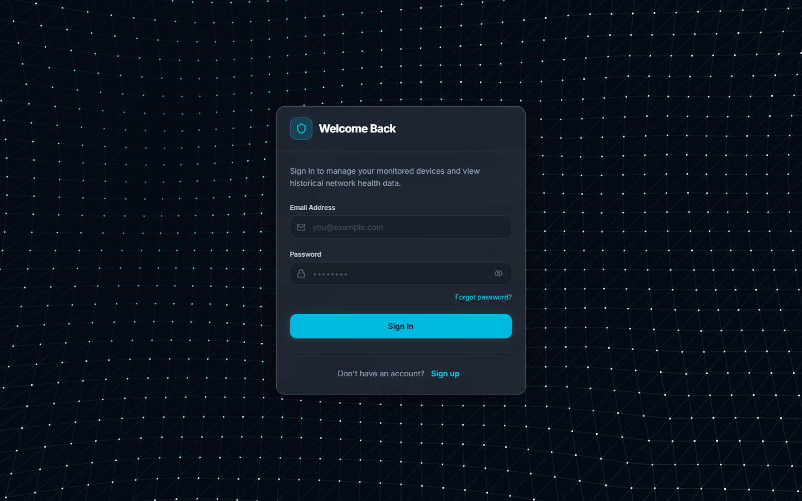</a>

The first thing every visitor sees — there is no anonymous mode. Password strength, email confirmation and a forgotten-password flow. A deep link you were blocked from is remembered and returned to after signing in.

</td>
<td width="50%" valign="top">

**🏠 Overview**

<a href="https://net-sentinal-bncz.vercel.app/"></a>

Health score, devices online, open incidents and latency trend. **Guided Troubleshooting** names the machine it measured and when, compares latency to that machine's own learned baseline (*26.8 ms over 121 samples*), reports loss with the probe count behind it, and states its confidence.

</td>
</tr>
<tr>
<td width="50%" valign="top">

**🖥️ Devices**

<a href="https://net-sentinal-bncz.vercel.app/devices">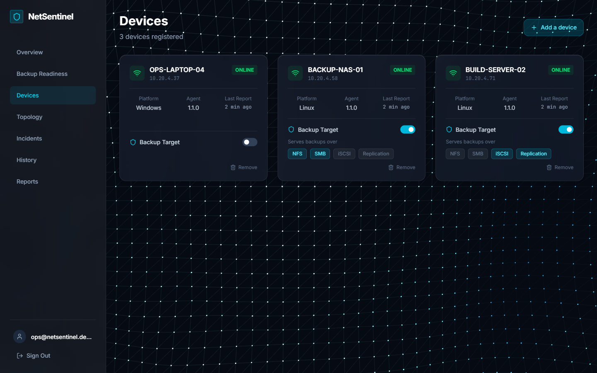</a>

Every machine on the account, with platform, address and time since last report. Online/offline is derived from the last check-in, so a stopped agent reads as offline rather than permanently online. Tag any device as a backup target and pick the protocols it serves.

</td>
<td width="50%" valign="top">

**➕ Add a device**

<a href="https://net-sentinal-bncz.vercel.app/devices">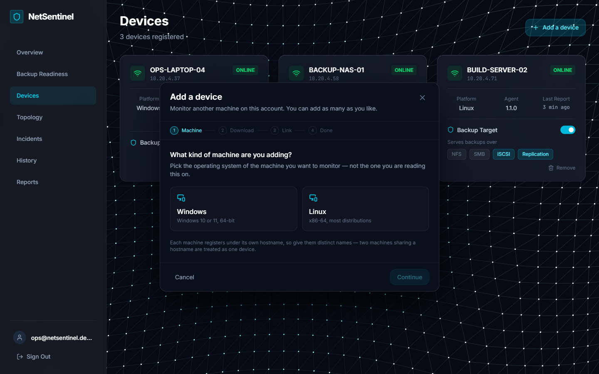</a>

Four steps: pick the OS, download the agent, type the 8-character code, done. The last step watches for the machine checking in and confirms itself — no "click here when finished".

</td>
</tr>
<tr>
<td width="50%" valign="top">

**💾 Backup Readiness**

<a href="https://net-sentinal-bncz.vercel.app/backup">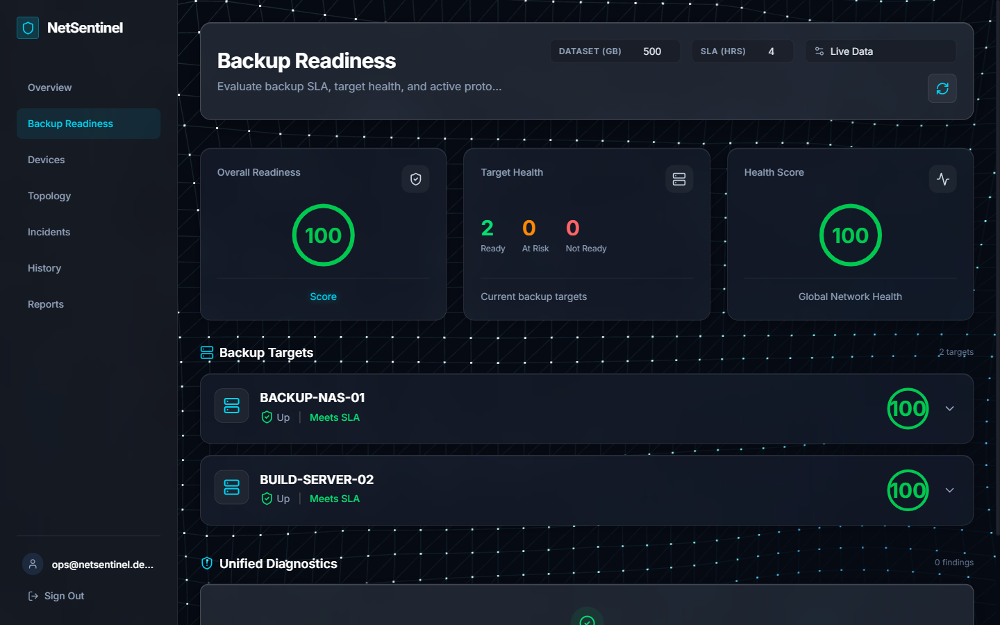</a>

Per-target reachability, DNS, link quality, protocol ports and SLA fit, scored 0–100 with correlated findings. Simulated failure scenarios (`dns-flap`, `port-blocked`, `throughput-drop`) run through the same scoring pipeline, so a demo and a real target are judged identically.

</td>
<td width="50%" valign="top">

**🚀 Getting Started**

<a href="https://net-sentinal-bncz.vercel.app/getting-started">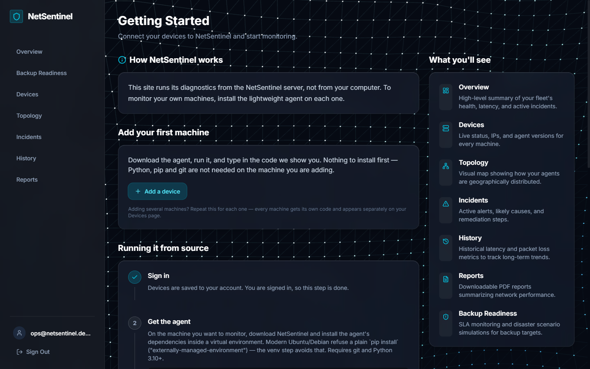</a>

Where a new account lands until it has its first agent, then it steps out of the way. Explains what the hosted scan does and does not measure, and hands over both the one-file and from-source routes.

</td>
</tr>
<tr>
<td width="50%" valign="top">

**🌐 Topology**

<a href="https://net-sentinal-bncz.vercel.app/topology">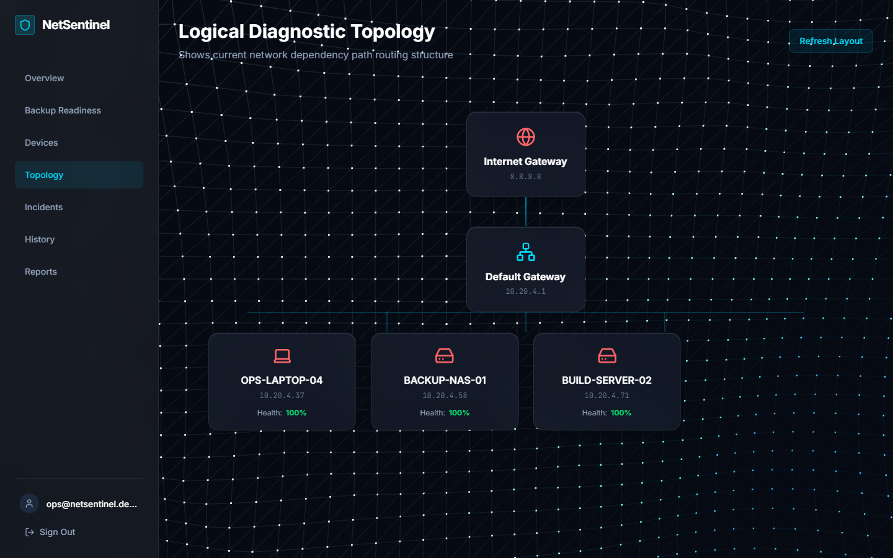</a>

Logical view of the fleet — internet path, default gateway and every reporting machine with its health, drawn from the gateway address each agent detected on its own host.

</td>
<td width="50%" valign="top">

**📈 History**

<a href="https://net-sentinal-bncz.vercel.app/history">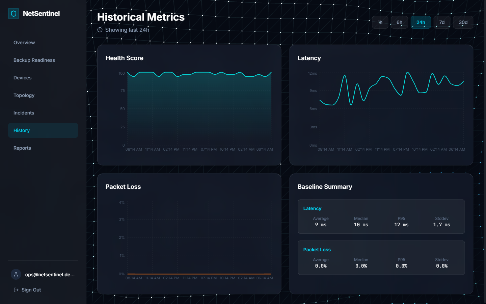</a>

Saved diagnostic runs over 1h / 6h / 24h / 7d / 30d, filtered server-side, with the **baseline summary** — average, median, P95 and standard deviation — computed from that history rather than assumed.

</td>
</tr>
<tr>
<td width="50%" valign="top">

**🚨 Incidents**

<a href="https://net-sentinal-bncz.vercel.app/incidents">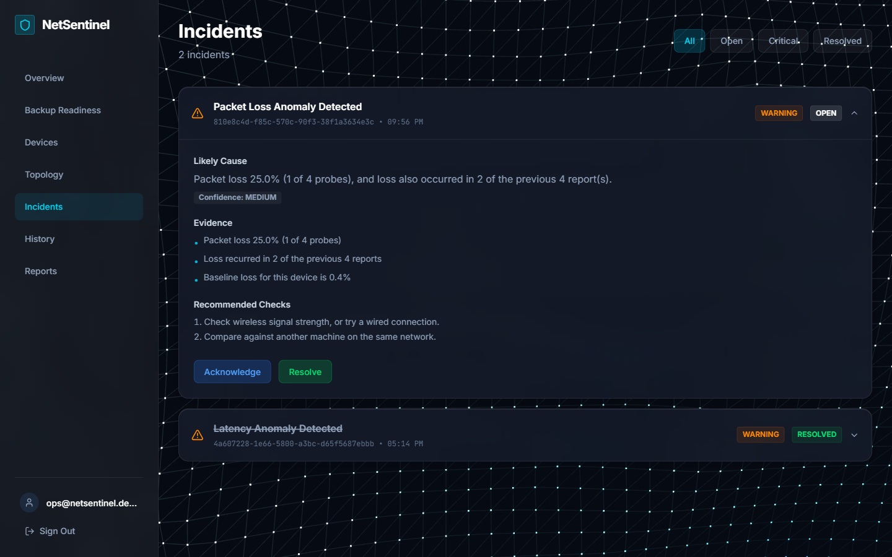</a>

Correlated events with likely cause, confidence and the evidence that raised them — note the loss figure carries *(1 of 4 probes)* and the fact that it recurred. Incidents close themselves when the condition clears, so a stale one cannot mask the next real occurrence.

</td>
<td width="50%" valign="top">

**📄 Reports**

<a href="https://net-sentinal-bncz.vercel.app/report">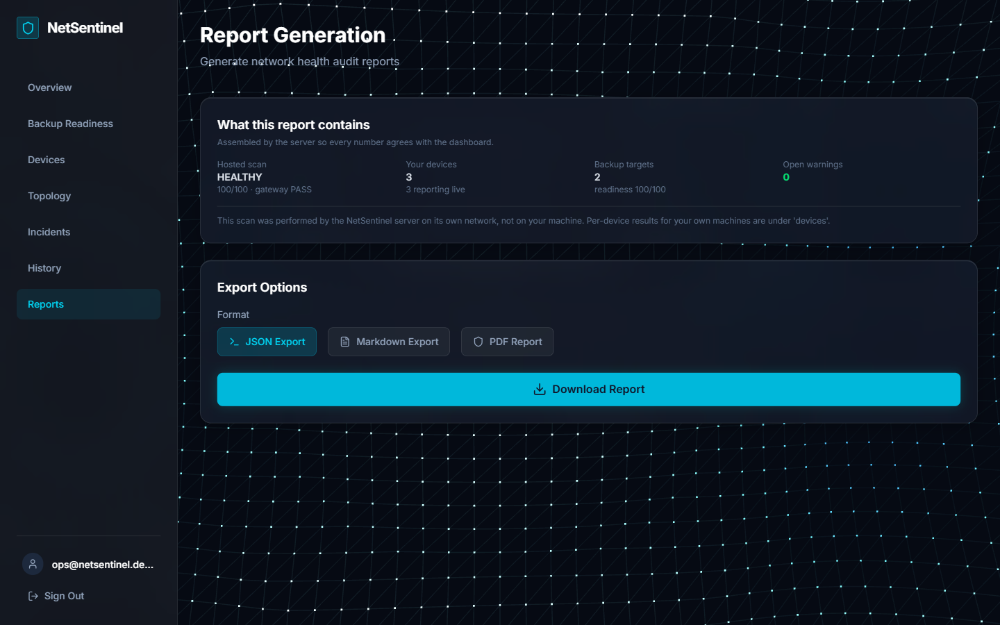</a>

Export as JSON, Markdown or **PDF** — a real engineer's report: executive summary, layer-by-layer evidence, per-device telemetry, trend graphs, backup readiness with the SLA arithmetic shown, and a methodology appendix.

</td>
</tr>
</table>

<div align="center"><sub>Click any image to open that page on <a href="https://net-sentinal-bncz.vercel.app/">net-sentinal-bncz.vercel.app</a>.<br>Captured from a local instance seeded with a synthetic three-machine fleet, so no real hostname or address appears here — see <a href="scripts/capture_screenshots.md">scripts/capture_screenshots.md</a> to reproduce them.</sub></div>

<br>

## 🔌 Adding a Machine

No Python, pip or git on the machine being added.

<table>
<tr><td width="25%" align="center"><b>1. Download</b></td><td>

Sign in → **Devices** → **Add a device** → pick Windows or Linux.
The binary carries no account details, so copying it to another machine is safe.

</td></tr>
<tr><td align="center"><b>2. Run</b></td><td>

Double-click it, or `./netsentinel-agent-linux --enroll`.

</td></tr>
<tr><td align="center"><b>3. Link</b></td><td>

Type the 8-character code the website shows. It expires in 15 minutes and works once.

</td></tr>
<tr><td align="center"><b>4. Done</b></td><td>

The machine registers under its own hostname and appears within a minute. Repeat per machine — one account holds as many as you like.

</td></tr>
</table>

**Keep it running:** the agent only reports while its process is alive. `agent/install_autostart.ps1` (Windows Scheduled Task) and `agent/install_autostart.sh` (systemd user service) register it to start at login and restart if it stops.

> Why a code and not the token? The agent token is long-lived and covers the whole account. A code is short enough to read off one screen and type on another, expires, and is single-use — so the real credential never has to be displayed, copied between machines, or embedded in a downloadable binary. See [docs/AGENT_DISTRIBUTION.md](docs/AGENT_DISTRIBUTION.md).

<br>

## 🏗️ Architecture

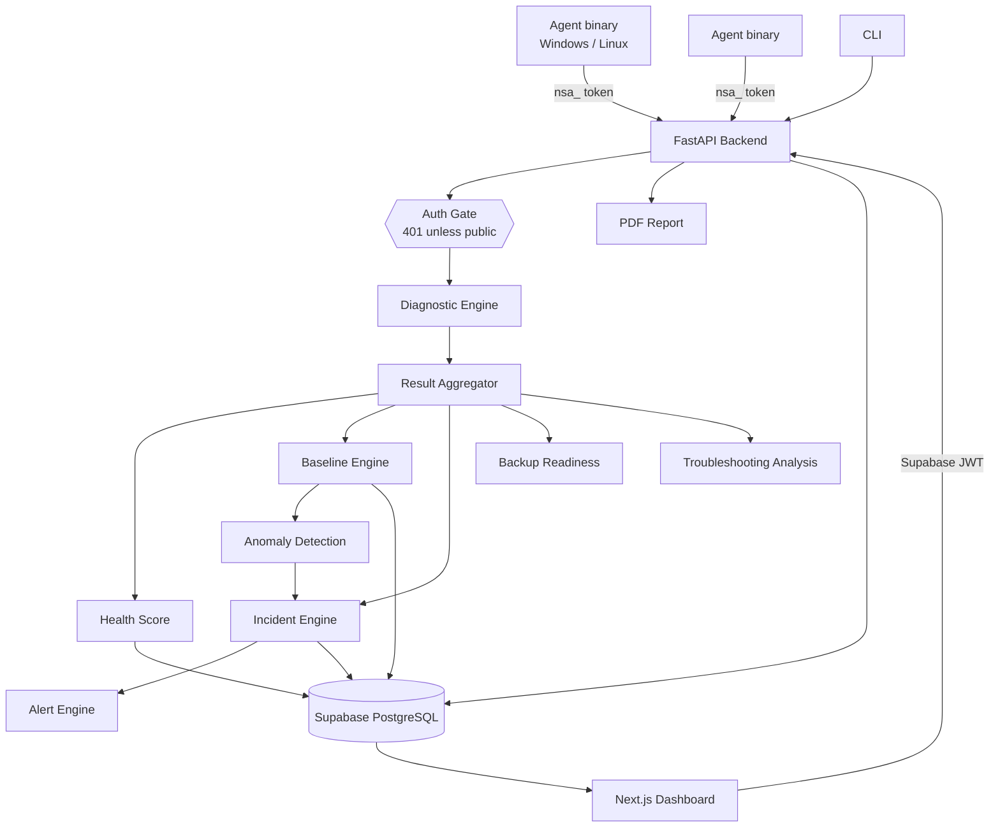

<details>
<summary><b>🧬 Diagnostic Pipeline</b> — click to expand</summary>

<br>

```
Local System
    ↓
Network Interface
    ↓
Default Gateway     ← lowest-metric route; ICMP-filtered ≠ failed
    ↓
Internet Connectivity
    ↓
DNS Resolution
    ↓
TCP Service Check
    ↓
Latency / Packet Loss
    ↓
Routing Information
    ↓
Diagnostic Engine   ← rule-based correlation
    ↓
Health Score
    ↓
Baseline Comparison ← avg / median / P95 / stddev, min 20 samples
    ↓
Anomaly Detection   ← deterministic thresholds, loss must recur
    ↓
Incident Engine     ← deduplication, lifecycle, auto-resolution
    ↓
Alert Engine        ← configurable rules
```

If a stage fails, downstream checks are skipped with an explanation instead of a misleading result:

```
Interface: FAIL
Gateway:   NOT TESTED (skipped: interface unavailable)
```

A gateway that drops ICMP while traffic flows through it is reported as **forwarding (ICMP filtered)**, not failed — common on cloud, container and enterprise networks.

</details>

<details>
<summary><b>📈 Project Evolution</b> — click to expand</summary>

<br>

| Version | Milestone | Flow |
|---|---|---|
| **v1** | Local Diagnostic Tool | `Machine → Diagnostics → CLI Output` |
| **v2** | Web Dashboard | `Machine → FastAPI → SQLite → Web Dashboard` |
| **v3** | Multi-Device Monitoring | `Agents → Backend → Supabase/PostgreSQL → Dashboard` |
| **v4** | Intelligent Troubleshooting | `Telemetry → Baselines → Anomalies → Correlation → Incidents` |
| **v5** | Backup Readiness & Reporting | `Telemetry → Protocol/SLA scoring → PDF engineer's report` |
| **v6** | Account-Gated Platform | `Login → Enrolment code → Agent binary → Per-account fleet` |

</details>

<br>

## 🧰 Technology Stack

<div align="center">

| Layer | Technologies |
|---|---|
| **Backend** |      |
| **Database** |   |
| **Frontend** |      |
| **Agent** |     |
| **Deployment** |    |
| **CI/CD** |  — tests on push, agent binaries built and released on tag |

</div>

<br>

## 🗄️ Database Schema

```
users (Supabase Auth)
  ├── user_profiles       onboarding state, login bookkeeping
  ├── agent_tokens        one nsa_ token per account
  ├── enrollment_codes    short-lived, single-use device codes
  ├── devices             hostname, platform, backup target + protocols
  │     ├── telemetry     latency, loss, DNS, gateway, backup ports
  │     ├── metric_baselines   avg / median / P95 / stddev per metric
  │     ├── incidents     lifecycle + evidence
  │     └── alerts        threshold breaches
  └── history             saved diagnostic runs
```

Every table is scoped by `user_id` with Row-Level Security. The backend uses the service-role key and filters by the account resolved from the session — never from a query parameter, header or request body. Migrations live in [`migrations/`](migrations/) and are applied in order (001 → 008).

<br>

## 🚀 Quick Start

<details open>
<summary><b>1️⃣ Supabase Setup</b></summary>

<br>

1. Create a project at [supabase.com](https://supabase.com)
2. Run every file in [`migrations/`](migrations/) in order via **SQL Editor**
3. Copy your keys from **Settings → API Keys**

```bash
cp .env.example .env
```

```env
SUPABASE_URL=https://your-project.supabase.co
SUPABASE_SERVICE_ROLE_KEY=sb_secret_...
API_BASE_URL=http://localhost:8000
```

> ⚠️ **Use the service-role key, not the publishable one.** Row-Level Security denies every per-user read and write when the backend authenticates with the publishable key, so devices, history and incidents silently stay empty. `/api/health` reports which key is in use under `database_access`.

> ⚠️ **Never commit `.env`.** It is already in `.gitignore`.

</details>

<details>
<summary><b>2️⃣ Backend</b></summary>

<br>

```bash
python -m venv venv
venv\Scripts\activate          # Windows
source venv/bin/activate       # Linux / macOS
pip install -r requirements.txt

python app.py --web
# → http://localhost:8000
```

</details>

<details>
<summary><b>3️⃣ Frontend</b></summary>

<br>

```bash
cd frontend
npm install
npm run dev
# → http://localhost:3000
```

</details>

<details>
<summary><b>4️⃣ Agent</b></summary>

<br>

**Recommended — the released binary:**

```bash
# Download from the Releases page, then:
./netsentinel-agent-linux --enroll     # asks for the code from the website
./netsentinel-agent-linux --start      # keep reporting
./netsentinel-agent-linux --status     # what is this machine linked to?
```

**From source:**

```bash
python -m venv .venv && source .venv/bin/activate
pip install -r agent/requirements.txt
python agent/agent.py --enroll
python agent/agent.py --start
```

**Build the binary yourself:**

```bash
pip install pyinstaller -r agent/requirements.txt
pyinstaller agent/netsentinel-agent.spec --noconfirm --clean
```

</details>

<details>
<summary><b>🐳 Docker (all-in-one)</b></summary>

<br>

```bash
docker compose up --build
```

| Service | URL |
|---|---|
| **backend** | `http://localhost:8000` |
| **frontend** | `http://localhost:3000` |
| **agent** | runs the telemetry loop |

</details>

<br>

## 💻 CLI Usage

```bash
python app.py                         # Full diagnostic
python app.py --quick                 # Quick scan
python app.py --json                  # JSON output
python app.py --domain github.com     # Custom domains
python app.py --host google.com       # Custom host
python app.py --port 443,80           # Custom ports
python app.py --demo healthy          # Demo: healthy
python app.py --demo dns-failure      # Demo: DNS failure
python app.py --demo gateway-failure  # Demo: gateway down
python app.py --demo high-latency     # Demo: high latency
python app.py --demo packet-loss      # Demo: packet loss
python app.py --web                   # Start web dashboard
```

<br>

## 🔌 API Reference

Every endpoint requires a valid session except the four marked **public**. Unauthenticated requests get a `401` with a machine-readable `code`, never a silent failure.

<div align="center">

| Method | Endpoint | Description |
|---|---|---|
|  | `/api/health` | **public** — health, database access mode, schema self-check |
|  | `/api/auth/session` | **public** — "am I logged in", org scope, onboarding state |
|  | `/api/auth/logout` | **public** — revokes the session server-side |
|  | `/api/agent/enroll` | **public** — exchanges an enrolment code for an agent token |
|  | `/api/agent/releases` | **public** — agent version and download links |
|  | `/api/diagnostic-run` | Run full diagnostics (`?demo=` for scenarios) |
|  | `/api/diagnostic-run` | Last run for this account |
|  | `/api/troubleshoot` | Guided analysis from measured history |
|  | `/api/history` | Diagnostic history (`?hours=`, `?limit=`) |
|  | `/api/devices` | Devices on this account |
|  | `/api/devices/{id}` | Remove a device |
|  | `/api/devices/{id}/backup-target` | Tag as backup target + protocols |
|  | `/api/devices/enroll-code` | Issue a device enrolment code |
|  | `/api/telemetry/latest` | Latest agent report per device |
|  | `/api/backup/readiness` | Backup readiness report (`?demo=` scenarios) |
|  | `/api/backup/protocols` | Supported backup protocols |
|  | `/api/report` | Server-assembled report document |
|  | `/api/report.pdf` | The same document as a printable PDF |
|  | `/api/incidents` | Incidents (`?status=`) |
|  | `/api/incidents/{id}/acknowledge` | Acknowledge |
|  | `/api/incidents/{id}/resolve` | Resolve |
|  | `/api/setup` | Setup guide, including this account's agent token |
|  | `/api/agent-token` | This account's agent token |
|  | `/api/agent-token/rotate` | Rotate it |
|  | `/api/agent/register` | *agent token* — idempotent device registration |
|  | `/api/agent/heartbeat` | *agent token* — liveness |
|  | `/api/agent/telemetry` | *agent token* — ingest a report |

</div>

<br>

## 🧪 Testing

```bash
pytest tests/ -q                                    # 394 tests, no network

# The built agent binary against a stub server
python scripts/verify_agent_binary.py dist/netsentinel-agent-windows.exe

# The built binary against the real API over HTTP, two machines, one account
python scripts/verify_add_device_e2e.py dist/netsentinel-agent-windows.exe

# Cold-start and redirect safety, against the real frontend client code
node --experimental-strip-types --no-warnings scripts/verify_auth_coldstart.mjs
```

Unit tests mock every external network operation and never touch a live Supabase project. The verification scripts run the real shipping code — the API, the auth gate, the agent binary, and the HTTP between them — against an in-memory store, because PyInstaller and cold-start failures are invisible to unit tests.

<br>

## 🛡️ Security Model

NetSentinel is a **monitoring tool**, not a security scanner.

<table>
<tr>
<td width="50%" valign="top">

**✅ It DOES:**
- Monitor the machine it is installed on
- Passively measure latency, DNS and connectivity
- Report evidence-based diagnostics
- Scope every row to one account

</td>
<td width="50%" valign="top">

**❌ It does NOT perform:**
- Mass / stealth port scanning
- Exploitation or credential attacks
- Packet interception
- ARP poisoning / MITM
- Firewall bypass

</td>
</tr>
</table>

**Access control** — one middleware in front of every request; a route is reachable without a session only if it is on an explicit public list, so forgetting to protect a new endpoint locks it rather than exposing it. Token validation is cached briefly and fails closed. Logout revokes the refresh token at Supabase, not just the browser copy. Details in [docs/ACCESS_CONTROL.md](docs/ACCESS_CONTROL.md).

**Agent credentials** — one token per account, never a shared global secret. An agent can only write to devices its own account owns. Enrolment codes are single-use, expire in 15 minutes, rate-limited, and return an identical message for unknown, expired and already-used so the endpoint cannot be probed.

<br>

## ⚖️ Limitations

- Baselines use simple statistics, not ML — deliberately, so every conclusion is explainable
- Network topology is logical (registered devices), not auto-discovered
- Supabase is required for multi-device features; without it only the local CLI and the legacy SQLite dashboard work
- Backup SLA estimates are derived from passively measured latency and loss, not an active bandwidth test — the report states this and shows the arithmetic
- The hosted backend runs on Render's free tier and sleeps when idle; the frontend waits out the cold start rather than reporting a failure

<br>

<details>
<summary><b>🎤 Interview Talking Points</b> — click to expand</summary>

<br>

| Topic | Explanation |
|---|---|
| **FastAPI** | Async REST API with automatic OpenAPI docs and dependency-injected auth |
| **Middleware over decorators** | Access control fails closed: forgetting a new endpoint locks it instead of exposing it |
| **Supabase** | Managed PostgreSQL + Auth + RLS without self-hosting |
| **Agents** | Network state has to be measured close to the machine being judged |
| **Enrolment codes** | A short-lived bearer code keeps the long-lived credential off screens and out of binaries |
| **Rule-based diagnostics** | Deterministic, evidence-based and auditable — no black-box scoring |
| **Statistical baselines** | Distinguish normal from abnormal per machine, and stay silent below 20 samples |
| **Incident auto-resolution** | An engine that only opens incidents goes blind, because stale rows suppress new ones |
| **PyInstaller + CI** | Removes the single biggest install barrier: having a working Python |
| **Honest empty states** | "Not enough history yet" is more useful than a confident invented number |

</details>

<br>

## 📄 License

Released under the [MIT License](LICENSE).

<br>

<div align="center">

**[⬆ back to top](#-netsentinel)**

<sub>Built with ⚡ by <a href="https://github.com/SiddharthaChathra">SiddharthaChathra</a></sub>

</div>
