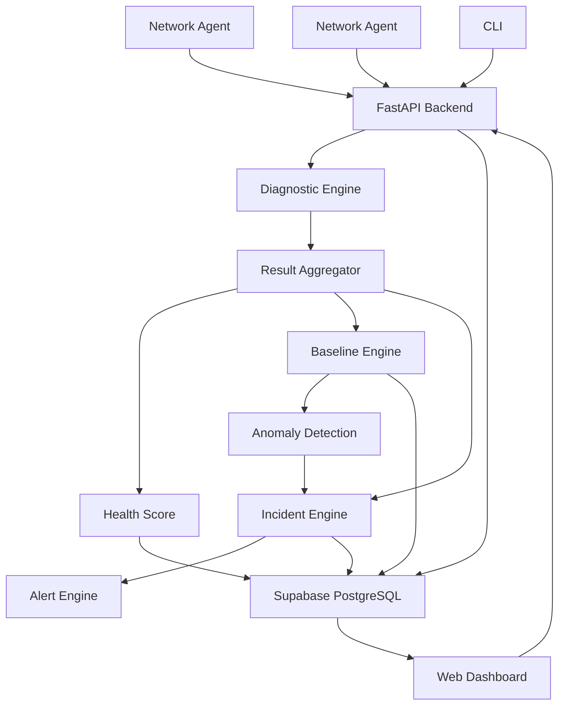

# NetSentinel

**Advanced Network Observability & Intelligent Troubleshooting Platform**

NetSentinel collects network telemetry from multiple devices via lightweight Python agents, builds historical baselines, detects anomalies, correlates evidence using a rule-based diagnostic engine, creates incidents, and explains likely network problems through a professional web dashboard.

---

## Architecture



---

## Why NetSentinel?

| Capability | Description |
|---|---|
| **Multi-Device Monitoring** | Lightweight Python agents collect telemetry from any machine |
| **Evidence-Based Diagnostics** | Rule-based correlation engine with explicit confidence levels |
| **Statistical Baselines** | Average, median, P95, stddev calculated from historical telemetry |
| **Anomaly Detection** | Deterministic detection when metrics exceed baseline thresholds |
| **Incident Management** | Open → Acknowledged → Resolved lifecycle with deduplication |
| **Threshold Alerts** | Configurable alerts for latency, packet loss, and health score |
| **Professional Dashboard** | Next.js + Tailwind with 3D animations and real-time charts |
| **Demo Mode** | Safe simulated scenarios for presentations without real failures |

---

## Project Evolution

### Version 1 — Local Diagnostic Tool
```
Machine → Diagnostics → CLI Output
```

### Version 2 — Web Dashboard
```
Machine → FastAPI → SQLite → Web Dashboard
```

### Version 3 — Multi-Device Monitoring
```
Agents → Backend → Supabase/PostgreSQL → Dashboard
```

### Version 4 — Intelligent Troubleshooting
```
Telemetry → Baselines → Anomalies → Correlation → Incidents → Dashboard
```

---

## Technology Stack

| Layer | Technology |
|---|---|
| Backend | Python 3.10+, FastAPI, Uvicorn, Pydantic |
| Database | Supabase (PostgreSQL, Auth, Realtime) |
| Frontend | Next.js 15, TypeScript, Tailwind CSS, Recharts, Framer Motion |
| Agent | Python, psutil, httpx |
| Deployment | Docker, Docker Compose |
| CI/CD | GitHub Actions |

---

## Database Schema

```
users (Supabase Auth)
devices
telemetry
diagnostic_runs
incidents
alerts
metric_baselines
```

---

## Diagnostic Pipeline

```
Local System
    ↓
Network Interface
    ↓
Default Gateway     ← dependency chain
    ↓
Internet Connectivity
    ↓
DNS Resolution
    ↓
TCP Service Check
    ↓
Latency / Packet Loss
    ↓
Routing Information
    ↓
Diagnostic Engine   ← rule-based correlation
    ↓
Health Score
    ↓
Baseline Comparison ← statistical baselines
    ↓
Anomaly Detection   ← deterministic thresholds
    ↓
Incident Engine     ← deduplication + lifecycle
    ↓
Alert Engine        ← configurable rules
```

If a stage fails, downstream checks are skipped with an explanation:
```
Interface: FAIL
Gateway:   NOT TESTED (skipped: interface unavailable)
```

---

## Supabase Setup

1. Create a project at [supabase.com](https://supabase.com)
2. Copy `SUPABASE_URL` and `SUPABASE_PUBLISHABLE_KEY` from Settings → API
3. Create a `.env` file from the template:

```bash
cp .env.example .env
# Edit .env with your credentials
```

Required environment variables:
```
SUPABASE_URL=https://your-project.supabase.co
SUPABASE_PUBLISHABLE_KEY=sb_publishable_...
AGENT_TOKEN=your-secret-agent-token
API_BASE_URL=http://localhost:8000
```

> **Never commit `.env` to Git.** It is already in `.gitignore`.

---

## Quick Start (Local Development)

### Backend
```bash
python -m venv venv
venv\Scripts\activate       # Windows
pip install -r requirements.txt

# Start web dashboard
python app.py --web
# → http://localhost:8000
```

### Frontend (Next.js)
```bash
cd frontend
npm install
npm run dev
# → http://localhost:3000
```

### Agent
```bash
python agent/agent.py --register
python agent/agent.py --once       # One-shot telemetry
python agent/agent.py --start      # Continuous monitoring
```

---

## CLI Usage

```bash
python app.py                         # Full diagnostic
python app.py --quick                 # Quick scan
python app.py --json                  # JSON output
python app.py --domain github.com     # Custom domains
python app.py --host google.com       # Custom host
python app.py --port 443,80           # Custom ports
python app.py --demo healthy          # Demo: healthy
python app.py --demo dns-failure      # Demo: DNS failure
python app.py --demo gateway-failure  # Demo: gateway down
python app.py --demo high-latency     # Demo: high latency
python app.py --demo packet-loss      # Demo: packet loss
python app.py --web                   # Start web dashboard
```

---

## API Endpoints

| Method | Path | Description |
|---|---|---|
| `GET` | `/api/health` | Application health check |
| `POST` | `/api/diagnostic-run` | Run full diagnostics |
| `GET` | `/api/diagnostic-run` | Get last run result |
| `GET` | `/api/history` | Diagnostic history |
| `GET` | `/api/export` | Export last run as JSON |
| `GET` | `/api/devices` | List all devices |
| `GET` | `/api/devices/{id}` | Get device details |
| `GET` | `/api/incidents` | List incidents |
| `POST` | `/api/incidents/{id}/acknowledge` | Acknowledge incident |
| `POST` | `/api/incidents/{id}/resolve` | Resolve incident |
| `POST` | `/api/agent/register` | Register agent device |
| `POST` | `/api/agent/heartbeat` | Agent heartbeat |
| `POST` | `/api/agent/telemetry` | Ingest telemetry |

---

## Docker

```bash
docker compose up --build
```

Services:
- **backend** → `http://localhost:8000`
- **frontend** → `http://localhost:3000`
- **agent** → runs telemetry loop

---

## Testing

```bash
pytest tests/ -v
```

All tests mock external network operations and do not depend on live internet.

---

## Security

NetSentinel is a **monitoring tool**, not a security scanner.

**It does NOT perform:**
- Mass port scanning
- Stealth scanning
- Exploitation
- Credential attacks
- Packet interception
- ARP poisoning / MITM
- Firewall bypass

The agent only monitors the machine on which it is installed.

---

## Limitations

- Baselines use simple statistical methods, not ML
- Network topology is logical (configured devices), not auto-discovered
- Supabase is required for multi-device features; without it, only the local CLI and legacy SQLite dashboard work
- The agent token is a shared secret, not per-device JWT authentication

---

## Interview Talking Points

| Topic | Explanation |
|---|---|
| **FastAPI** | Lightweight async REST API with automatic OpenAPI docs |
| **Supabase** | Managed PostgreSQL + Auth + Realtime without self-hosting |
| **Agents** | Network state must be measured close to the monitored machine |
| **Rule-based diagnostics** | Explanations are deterministic, evidence-based, and auditable |
| **Statistical baselines** | Distinguish normal from abnormal using avg/median/P95/stddev |
| **Incidents** | Convert raw telemetry into actionable operational events |
| **Docker** | Reproducible deployment across environments |
| **SQLite fallback** | Standalone mode works without external database |
