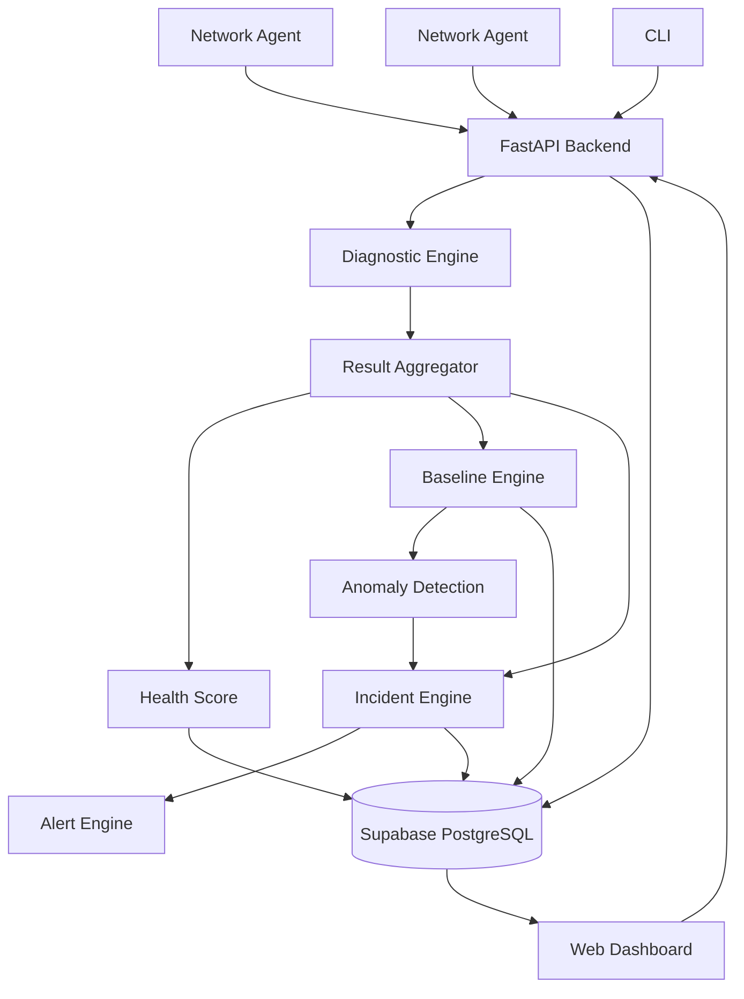

<div align="center">

# 🛰️ NetSentinel

### Advanced Network Observability & Intelligent Troubleshooting Platform

Multi-device telemetry · Statistical baselines · Rule-based diagnostics · Incident correlation — served through a real-time web dashboard.

<p>
  <a href="https://net-sentinal-bncz.vercel.app/"></a>
</p>

<p>
  
  
  
  
  
</p>

<p>
  
  
  
  
  
  
</p>

<p>
  <a href="#-why-netsentinel"><b>Why</b></a> ·
  <a href="#%EF%B8%8F-architecture"><b>Architecture</b></a> ·
  <a href="#-technology-stack"><b>Stack</b></a> ·
  <a href="#-quick-start"><b>Quick Start</b></a> ·
  <a href="#-cli-usage"><b>CLI</b></a> ·
  <a href="#-api-reference"><b>API</b></a> ·
  <a href="#-security-model"><b>Security</b></a> ·
  <a href="#-license"><b>License</b></a>
</p>

</div>

<br>

NetSentinel collects network telemetry from multiple devices via lightweight Python agents, builds historical baselines, detects anomalies, correlates evidence using a rule-based diagnostic engine, creates incidents, and explains likely network problems through a professional web dashboard.

<br>

## 🎯 Why NetSentinel?

<table>
<tr>
<td width="50%" valign="top">

**📡 Multi-Device Monitoring**
Lightweight Python agents collect telemetry from any machine on the network.

**🔍 Evidence-Based Diagnostics**
Rule-based correlation engine with explicit confidence levels — no black-box ML guessing.

**📊 Statistical Baselines**
Average, median, P95, and standard deviation calculated from historical telemetry.

**⚠️ Anomaly Detection**
Deterministic detection when live metrics exceed learned baseline thresholds.

</td>
<td width="50%" valign="top">

**🚨 Incident Management**
Open → Acknowledged → Resolved lifecycle with automatic deduplication.

**🔔 Threshold Alerts**
Configurable alerts for latency, packet loss, and overall health score.

**💎 Professional Dashboard**
Next.js + Tailwind CSS with 3D animations and real-time charts.

**🎭 Demo Mode**
Safe simulated failure scenarios for presentations — no real outages required.

</td>
</tr>
</table>

<br>

## 🏗️ Architecture



<details>
<summary><b>🧬 Diagnostic Pipeline</b> — click to expand</summary>

<br>

```
Local System
    ↓
Network Interface
    ↓
Default Gateway     ← dependency chain
    ↓
Internet Connectivity
    ↓
DNS Resolution
    ↓
TCP Service Check
    ↓
Latency / Packet Loss
    ↓
Routing Information
    ↓
Diagnostic Engine   ← rule-based correlation
    ↓
Health Score
    ↓
Baseline Comparison ← statistical baselines
    ↓
Anomaly Detection   ← deterministic thresholds
    ↓
Incident Engine     ← deduplication + lifecycle
    ↓
Alert Engine        ← configurable rules
```

If a stage fails, downstream checks are skipped with an explanation instead of a misleading result:

```
Interface: FAIL
Gateway:   NOT TESTED (skipped: interface unavailable)
```

</details>

<details>
<summary><b>📈 Project Evolution</b> — click to expand</summary>

<br>

| Version | Milestone | Flow |
|---|---|---|
| **v1** | Local Diagnostic Tool | `Machine → Diagnostics → CLI Output` |
| **v2** | Web Dashboard | `Machine → FastAPI → SQLite → Web Dashboard` |
| **v3** | Multi-Device Monitoring | `Agents → Backend → Supabase/PostgreSQL → Dashboard` |
| **v4** | Intelligent Troubleshooting | `Telemetry → Baselines → Anomalies → Correlation → Incidents → Dashboard` |

</details>

<br>

## 🧰 Technology Stack

<div align="center">

| Layer | Technology |
|:---|:---|
| **Backend** |     |
| **Database** |   |
| **Frontend** |      |
| **Agent** |    |
| **Deployment** |    |
| **CI/CD** |  |

</div>

<br>

## 🗄️ Database Schema

```
users (Supabase Auth)
devices
telemetry
diagnostic_runs
incidents
alerts
metric_baselines
```

<br>

## 🚀 Quick Start

<details open>
<summary><b>1️⃣ Supabase Setup</b></summary>

<br>

1. Create a project at [supabase.com](https://supabase.com)
2. Copy `SUPABASE_URL` and `SUPABASE_PUBLISHABLE_KEY` from **Settings → API**
3. Create a `.env` file from the template:

```bash
cp .env.example .env
# Edit .env with your credentials
```

Required environment variables:

```env
SUPABASE_URL=https://your-project.supabase.co
SUPABASE_PUBLISHABLE_KEY=sb_publishable_...
AGENT_TOKEN=your-secret-agent-token
API_BASE_URL=http://localhost:8000
```

> ⚠️ **Never commit `.env` to Git.** It is already in `.gitignore`.

</details>

<details>
<summary><b>2️⃣ Backend</b></summary>

<br>

```bash
python -m venv venv
venv\Scripts\activate       # Windows
pip install -r requirements.txt

# Start web dashboard
python app.py --web
# → http://localhost:8000
```

</details>

<details>
<summary><b>3️⃣ Frontend (Next.js)</b></summary>

<br>

```bash
cd frontend
npm install
npm run dev
# → http://localhost:3000
```

</details>

<details>
<summary><b>4️⃣ Agent</b></summary>

<br>

```bash
python agent/agent.py --register
python agent/agent.py --once       # One-shot telemetry
python agent/agent.py --start      # Continuous monitoring
```

</details>

<details>
<summary><b>🐳 Docker (all-in-one)</b></summary>

<br>

```bash
docker compose up --build
```

| Service | URL |
|---|---|
| **backend** | `http://localhost:8000` |
| **frontend** | `http://localhost:3000` |
| **agent** | runs telemetry loop |

</details>

<br>

## 💻 CLI Usage

```bash
python app.py                         # Full diagnostic
python app.py --quick                 # Quick scan
python app.py --json                  # JSON output
python app.py --domain github.com     # Custom domains
python app.py --host google.com       # Custom host
python app.py --port 443,80           # Custom ports
python app.py --demo healthy          # Demo: healthy
python app.py --demo dns-failure      # Demo: DNS failure
python app.py --demo gateway-failure  # Demo: gateway down
python app.py --demo high-latency     # Demo: high latency
python app.py --demo packet-loss      # Demo: packet loss
python app.py --web                   # Start web dashboard
```

<br>

## 🔌 API Reference

<div align="center">

| Method | Path | Description |
|:---:|:---|:---|
|  | `/api/health` | Application health check |
|  | `/api/diagnostic-run` | Run full diagnostics |
|  | `/api/diagnostic-run` | Get last run result |
|  | `/api/history` | Diagnostic history |
|  | `/api/export` | Export last run as JSON |
|  | `/api/devices` | List all devices |
|  | `/api/devices/{id}` | Get device details |
|  | `/api/incidents` | List incidents |
|  | `/api/incidents/{id}/acknowledge` | Acknowledge incident |
|  | `/api/incidents/{id}/resolve` | Resolve incident |
|  | `/api/agent/register` | Register agent device |
|  | `/api/agent/heartbeat` | Agent heartbeat |
|  | `/api/agent/telemetry` | Ingest telemetry |

</div>

<br>

## 🧪 Testing

```bash
pytest tests/ -v
```

All tests mock external network operations and do not depend on live internet.

<br>

## 🛡️ Security Model

NetSentinel is a **monitoring tool**, not a security scanner.

<table>
<tr>
<td width="50%" valign="top">

**✅ It DOES:**
- Monitor the machine it's installed on
- Passively measure latency, DNS, and connectivity
- Report evidence-based diagnostics

</td>
<td width="50%" valign="top">

**❌ It does NOT perform:**
- Mass / stealth port scanning
- Exploitation or credential attacks
- Packet interception
- ARP poisoning / MITM
- Firewall bypass

</td>
</tr>
</table>

<br>

## ⚖️ Limitations

- Baselines use simple statistical methods, not ML
- Network topology is logical (configured devices), not auto-discovered
- Supabase is required for multi-device features; without it, only the local CLI and legacy SQLite dashboard work
- The agent token is a shared secret, not per-device JWT authentication

<br>

<details>
<summary><b>🎤 Interview Talking Points</b> — click to expand</summary>

<br>

| Topic | Explanation |
|---|---|
| **FastAPI** | Lightweight async REST API with automatic OpenAPI docs |
| **Supabase** | Managed PostgreSQL + Auth + Realtime without self-hosting |
| **Agents** | Network state must be measured close to the monitored machine |
| **Rule-based diagnostics** | Explanations are deterministic, evidence-based, and auditable |
| **Statistical baselines** | Distinguish normal from abnormal using avg/median/P95/stddev |
| **Incidents** | Convert raw telemetry into actionable operational events |
| **Docker** | Reproducible deployment across environments |
| **SQLite fallback** | Standalone mode works without external database |

</details>

<br>

## 📄 License

Released under the [MIT License](LICENSE).

<br>

<div align="center">

**[⬆ back to top](#-netsentinel)**

<sub>Built with ⚡ by <a href="https://github.com/SiddharthaChathra">SiddharthaChathra</a></sub>

</div>
